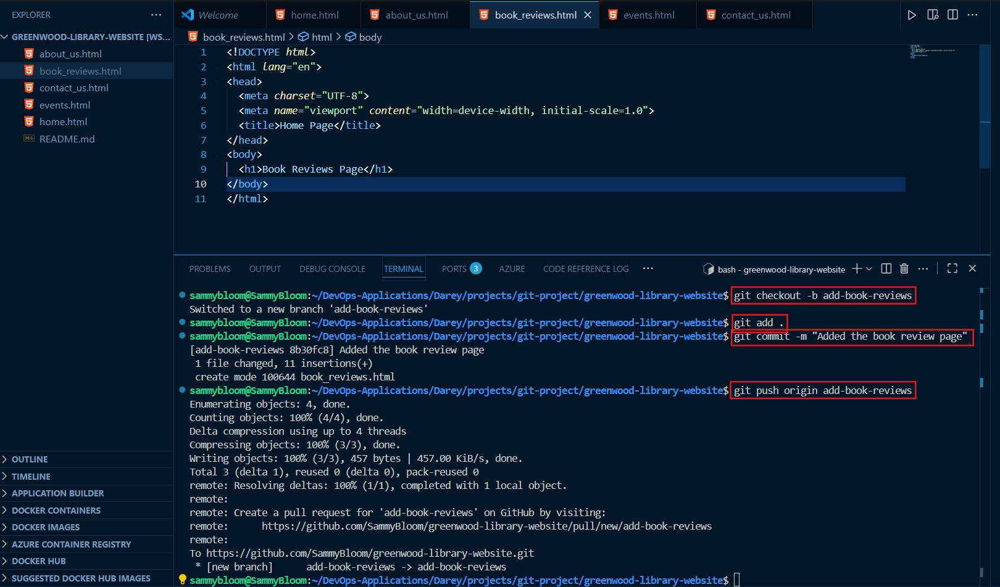

# Capstone Project: Enhancing a COmmunity Library Website
In this capstone project, we'll create a step-by-step project to simulate the workflow of Morgan and Jamie using Git and GitHub. This hands-on project will include cloning the repository, creating branches, making changes, and merging those changes back into the main branch.

## greenwood-library-website
A project that show how functional teams use GitHub for collaboration

### Solution
#### Create a New Repository
Creating a new repository in Github

#### Initial Main Branch
Pushing the starter code to the main branch.

#### Morgan's Work: Adding Book Reviews
1. Create and switch to the _**add-book-reviews**_ branch.
2. Add a new file _**book_reviews.html**_ to represent the Book Reviews section. Populate this file.
3. Stage, Commit, and Push changes to _**add-book-reviews**_.

4. Create a Pull Request (PR) for Morgan's Work.

5. Merge Morgan's work to main.

#### Jamie's Work: Updating Events Page
Repeat the same flow for Jamie's work on Events Page. Jamie's work should be in the _**update-events**_ branch.

_Pull changes from the main branch into update-events before raising a Pull Request._

- After Jamie makes changes, in the update-events branch, he fetches the codes in the main branch before pushing his work. 

- Create a Pull Request (PR)

- Merge PR to _Main branch_

The final GitHub Dashboard looks like this:

**Repository Link**
[Greenwood Community Library](https://github.com/SammyBloom/greenwood-library-website.git) OR https://github.com/SammyBloom/greenwood-library-website.git
